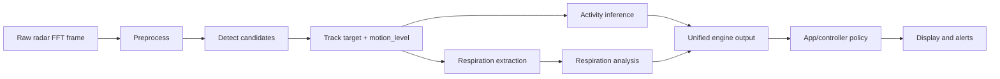
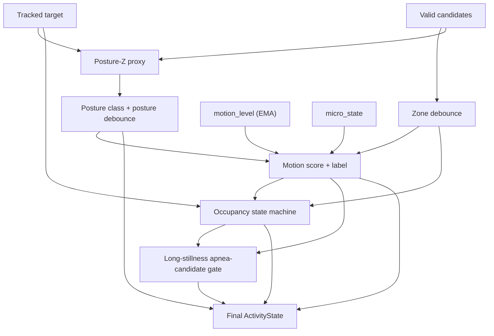
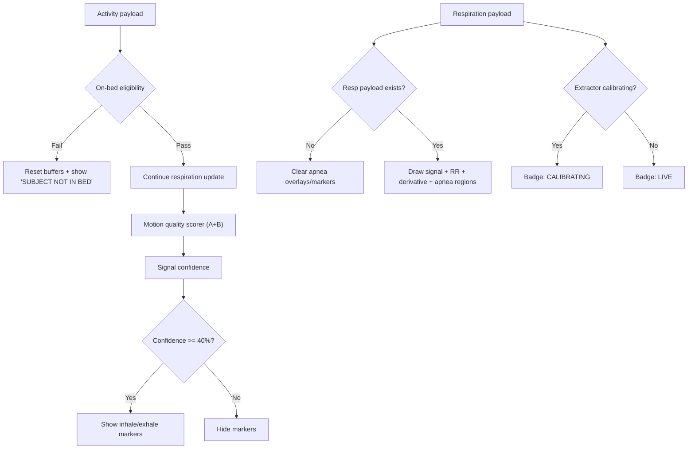

# Advisor Methods Brief: Activity and Respiration Logic

This document explains how the current implementation computes and gates:
- Activity outputs (presence, posture, motion, stillness, fall-related states)
- Respiration outputs (wave display, RR, characteristic points, apnea)

It is intentionally written as a methods note with formulas, thresholds, and gate conditions.

## 1) System View

## 2) Activity Pipeline (A)

### 2.1 Data and featured variables used

| Stage | Main Inputs | Main Computed Variables |
|---|---|---|
| Candidate detection | `dynamic_mag_profile`, CFAR threshold, zone validity | candidate bin, `(x,y,z)`, candidate score, zone |
| Tracking | valid candidates over time | smoothed `(x,y,z)`, `track_confidence`, `miss_count`, `v_z`, `motion_level` |
| Posture | tracked `(x,y,z)` + nearby candidates | `posture_z`, posture label, posture confidence |
| Motion | `motion_level`, micro-state, zone | `motion_score`, coarse motion label, walking flag |
| Occupancy | track continuity + motion label | occupancy state, occupancy confidence |
| Activity state | all above | final typed `ActivityState` |

### 2.2 Activity decision flow

### 2.3 Detailed methods and parameters

| Output / Decision | Method | Parameters / Thresholds (current) |
|---|---|---|
| Zone label | best valid candidate zone, then debounce | zone debounce: 5 consecutive agreeing frames |
| Posture Z proxy | max candidate `z` near tracked XY; fallback to tracked `z` | XY neighborhood: `posture_z_neighborhood_m` (default 0.30 m), optional bias |
| Standing/Sitting/Lying | thresholded `posture_z` | sitting threshold default 0.45 m, standing threshold default 0.95 m |
| Posture stabilization | hysteresis by repeated agreement | posture confirm: 8 consecutive agreeing frames |
| `motion_level` | EMA of inter-frame XY displacement | tracker `motion_ema_alpha = 0.15` |
| `motion_score` | continuous normalized score | `motion_score = min(1, motion_level / restless_max)` |
| Resting vs Shifting | coarse label from `motion_score` | Resting when `motion_score < rest_max/restless_max`; else Shifting |
| Walking | override rule | requires: `micro_state == MACRO_PHASE`, `motion_level > restless_max`, zone contains Transit/Floor |
| Entering -> Occupied | occupancy state machine | frames to occupy: `entry_hold_seconds * 25` (default 3.0 s -> 75 frames) |
| Monitoring vs Occupied | occupancy label from motion class | Resting/Static/Fidgeting -> Monitoring; else Occupied |
| Apnea candidate (activity) | long stillness counter | 150 consecutive Resting/Static frames (~6 s at 25 fps) |

### 2.4 Activity formulas

- Motion level update (tracker):
  - `disp_t = sqrt((x_t - x_{t-1})^2 + (y_t - y_{t-1})^2)`
  - `motion_level_t = alpha * disp_t + (1 - alpha) * motion_level_{t-1}`, `alpha=0.15`
- Motion score:
  - `motion_score = clamp(motion_level / restless_max, 0, 1)`

---

## 3) Respiration Pipeline (B)

### 3.1 Display gating overview (`p1_resp_gui`)

### 3.2 Respiratory signal extraction (engine)

| Step | Method | Current parameters |
|---|---|---|
| Eligibility | require spectral history and confirmed target bin | if missing -> respiration inactive |
| Bin lock | lock to target bin; re-lock when macro motion | re-lock when `micro_state == MACRO_PHASE` |
| Spatial fusion | sum bins `(locked_bin-1 ... locked_bin+1)` | simple 3-bin sum |
| Phase unwrap | custom ambiguity unwrap in degrees | ±180° wrap correction |
| Breathing signal | phase difference then low-pass | Butterworth low-pass, order 4, cutoff 0.5 Hz |
| Derivative path | normalized abs gradient | `scale_derivative = abs(grad(signal))/0.2` |
| Display buffers | rolling frozen buffers | window length = `window_sec * fps` |
| Apnea threshold calibration | dynamic threshold after warmup | after ~40 s: `threshold = max(0.05, 0.25 * P95(derivative))` |

### 3.3 RR and characteristic points

| Item | Method | Parameters |
|---|---|---|
| Characteristic points | `find_peaks` on signal and `-signal` | min peak distance: `0.5*fs`; prominence: `max(0.05, 0.25*ptp(signal))` |
| Exhale points | positive peaks | returned as `peaks` |
| Inhale points | troughs (peaks of negated signal) | returned as `troughs` |
| Cycle duration | consecutive exhale peaks in global frame index | valid only if `0.5 < duration < 6.0 s` |
| RR baseline | rolling average over last `history_size` cycle durations | default history size = 5, `RR=60/avg_duration` |
| RR dropout handling | anchor-based decay if no fresh peak | if stale peak, use `60 / time_since_last_peak` |
| Apnea RR override | avoid implausible low RR during apnea | if apnea active and RR < 6 bpm -> RR set to 0 |
| BRV (variability) | std of cycle durations | `BRV = std(cycle_durations)` |
| Breath depth class | amplitude `|last_peak - last_trough|` in recent window | shallow `<5`, deep `>15`, else normal |

### 3.4 Apnea detection and display criteria

| Component | Method | Current criteria |
|---|---|---|
| Apnea binary detector | derivative-percentile gate in last 5 s | apnea if `P95(derivative_last_5s) <= apnea_threshold` AND threshold calibrated |
| Event deduplication | global-segment merge | merge neighboring segments within 0.5 s gap |
| Apnea duration | running frame count while apnea active | `duration_s = live_apnea_frames / fps` |
| UI apnea overlays | drawn from apnea segments | shown when resp payload exists |
| Marker gating | inhale/exhale markers | only when confidence >= 40% |

---

## 4) Practical interpretation notes for judged/displayed results

1. Activity labels are intentionally stabilized (debounce + hysteresis), so short transients are suppressed.
2. Motion display should be interpreted from `motion_score` first (continuous), and motion label second (coarse).
3. Respiration quality and marker display are independently gated by confidence; visible waves do not always imply “high-quality RR.”
4. RR can be intentionally conservative during apnea/low-quality periods (including forced-zero behavior under apnea + very low RR).

## 5) Source references

- Activity inference: `radar_engine/activity/inferencer.py`
- Tracking and motion-level EMA: `radar_engine/tracking/target_tracker.py`
- Resp signal extraction and threshold calibration: `radar_engine/respiration/extractor.py`
- RR, peaks, apnea logic: `radar_engine/respiration/analyzer.py`, `radar_engine/respiration/peaks.py`, `radar_engine/respiration/rr.py`, `radar_engine/respiration/apnea.py`
- GUI gating logic: `p1_resp_gui.py`
